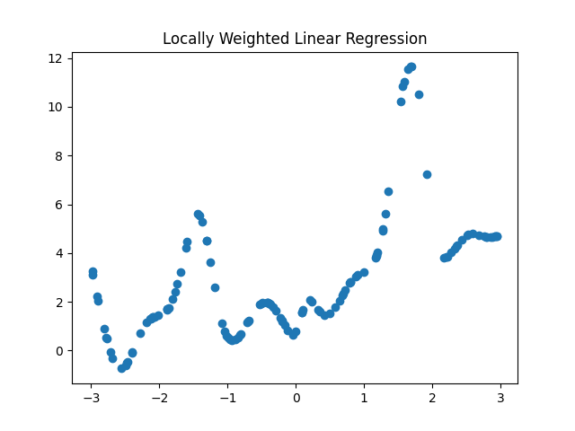
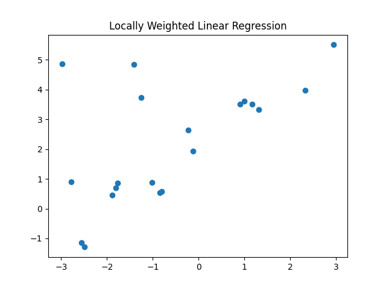

# Regression and Logistic Regression Analysis

## 📌 Overview
This project implements **Linear Regression, Locally Weighted Linear Regression (LWLR), and Logistic Regression** from scratch. The primary goals include:
- Understanding function approximation through regression.
- Analyzing local vs. global regression performance.
- Implementing classification for gender prediction using logistic regression.

---

## 📊 Objectives

### **Q1: Linear Regression**
- Implement **Linear Regression** using **trigonometric basis functions**.
- Study the effect of different function complexities (`k`) and depths (`d`).
- Analyze overfitting using **Mean Squared Error (MSE)**.

#### **📌 Training Data Plotted**
.png)

#### **📌 Model Performance with Reduced Data**
.png)

📌 **Key Insight**: Higher complexity improves accuracy but excessive `d` values lead to **overfitting**.

---

### **Q2: Locally Weighted Linear Regression (LWLR)**
- Implement **LWLR**, giving more importance to nearby data points.
- Compare **global vs. local regression** performance.
- Evaluate **MSE** for different training data sizes.

#### **📌 LWLR Model Output (128 Training Data)**

#### **📌 LWLR Model Output (20 Training Data)**

📌 **Key Insight**: **LWLR adapts better to non-linear datasets**, but small training sets increase error.

---

### **Q3: Logistic Regression (Classification)**
- Implement **Logistic Regression** for gender classification (Male/Female).
- Evaluate the model using **cross-validation** and compare it with **KNN** and **Naïve Bayes** classifiers.
- Analyze the impact of **removing "Age"** as a feature.

#### **📌 3D Decision Boundary**
.png)

#### **📌 Alternative 3D View**
.png)

#### **📌 Decision Boundary Without "Age" Feature**
.png)

📌 **Key Insight**: Logistic regression performs well, but removing "Age" slightly decreases accuracy.
